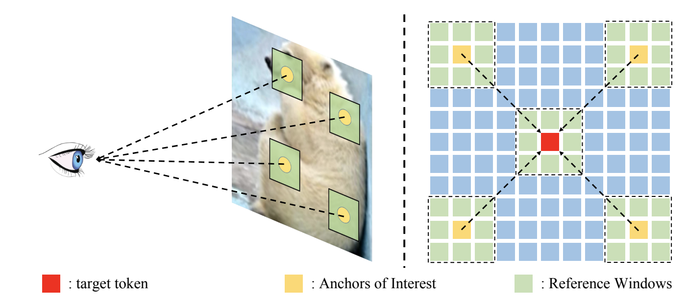

# SSViT
official code for "Vision Transformer with Sparse Scan Prior"
[Arxiv](https://arxiv.org/abs/2405.13335)
## Abstract
In recent years, Transformers have achieved remarkable progress in computer vision tasks. However, their global modeling often comes with substantial computational overhead, in stark contrast to the human eye’s efficient information processing. Inspired by the human eye’s sparse scanning mechanism, we propose a Sparse Scan Self-Attention mechanism (S3A). This mechanism predefines a series of Anchors of Interest for each token and employs local attention to efficiently model the spatial information around these anchors, avoiding redundant global modeling
and excessive focus on local information. This approach mirrors the human eye’s functionality and significantly reduces the computational load of vision models. Building on S3A, we introduce the Sparse Scan Vision Transformer (SSViT). Extensive experiments demonstrate the outstanding performance of SSViT across a variety of tasks. Specifically, on ImageNet classification, without additional supervision or training data, SSViT achieves top-1 accuracies of 84.4%/85.7% with 4.4G/18.2G FLOPs. SSViT also excels in downstream tasks such as object detection, instance segmentation, and semantic segmentation. Its robustness is further validated across diverse datasets.



### Results
|Model|Params|FLOPs|Acc|log|
|:---:|:---:|:---:|:---:|:---:|
|SSViT-T|15M|2.4G|83.0%|[SSViT-T(epoch297)](SSViT_log/SSViT-T.txt)|
|SSViT-S|27M|4.4G|84.4%|[SSViT-S(epoch244)](SSViT_log/SSViT-S.txt)|
|SSViT-B|57M|9.6G|85.3%|[SSViT-B(epoch236)](SSViT_log/SSViT-B.txt)|
|SSViT-L|100M|18.2G|85.6%|[SSViT-L(epoch231)](SSViT_log/SSViT-L.txt)|

## Citation

If you use SSViT in your research, please consider the following BibTeX entry and giving us a star:
```BibTeX
@misc{fan2024vision,
      title={Vision Transformer with Sparse Scan Prior}, 
      author={Qihang Fan and Huaibo Huang and Mingrui Chen and Ran He},
      year={2024},
      eprint={2405.13335},
      archivePrefix={arXiv},
      primaryClass={cs.CV}
}
